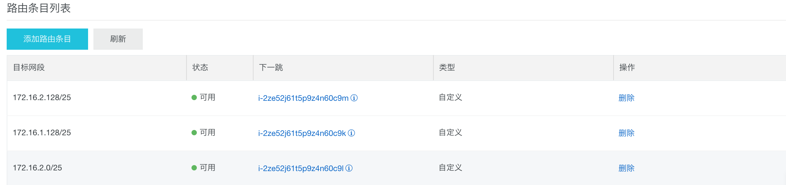

# Day 2 - Kubernetes Core Concept

## 0. 课前准备工作

* 准备Kubernetes命名空间：

> 未安装kubernetes-cli的同学，参考Day 1的文档安装

```
$ kubectl create namespace YOUR_NAME
$ alias k="kubectl -n YOUR_NAME" # 后续使用k操作自己的命名空间
$ k get pods
```

* 准备镜像仓库：

```
$ export DOCKER_NAMESPACE=k8s-mirrors #修改为自己的仓库
$ export DOCKER_REPO=registry.cn-hangzhou.aliyuncs.com/$DOCKER_NAMESPACE/kube-app
```

* 下载实例项目：

本机未完成Day1内容的同学，可以从[kube-app实例项目](http://7pn5d3.com1.z0.glb.clouddn.com/kube-app-v2.zip)下载实例项目。

* 准备应用

确保kube-app已经正常运行：

修改deploy/manifests/kube-app-rbac-setup.yaml：

```
apiVersion: rbac.authorization.k8s.io/v1beta1
kind: ClusterRole
metadata:
  name: cloud:service
rules:
- apiGroups: [""]
  resources:
  - nodes
  - services
  - endpoints
  - pods
  - configmaps
  verbs: ["get", "list", "watch"]
- apiGroups:
  - extensions
  resources:
  - ingresses
  verbs: ["get", "list", "watch"]
---
apiVersion: rbac.authorization.k8s.io/v1beta1
kind: ClusterRoleBinding
metadata:
  name: default
roleRef:
  apiGroup: rbac.authorization.k8s.io
  kind: ClusterRole
  name: cloud:service
subjects:
- kind: ServiceAccount
  name: default
  namespace: yunlong # 请切换到自己的命名空间
```

准备应用

```
$ k apply -f deploy/manifests/kube-app-rbac-setup.yaml
$ k apply -f deploy/manifests/echo-server-pod.yaml
$ k apply -f deploy/manifests/echo-server-svc.yaml
$ k apply -f deploy/manifests/kube-app-pod.yaml
```

验证Pod能够正常运行

```
$ k exec -it kube-app-pod curl http://127.0.0.1:7001/echo/a
Request served by echo

HTTP/1.1 GET /echo/a

Host: 172.16.2.123:8080
Accept: text/plain, application/json, application/*+json, */*
User-Agent: Java/1.8.0_111
Connection: keep-alive
```

## 1. 访问集群内的应用

> 思考，我们现在是如何将应用暴露给用户的


创建Service并且关联kube-app应用，创建文件`deploy/manifests/kube-app-svc.yaml`：

```
apiVersion: v1
kind: Service
metadata:
  labels:
    run: kube-app
  name: kube-app
spec:
  ports:
  - port: 7001
    protocol: TCP
    targetPort: 7001
  selector:
    run: kube-app
  type: ClusterIP
```

使用`k apply`命名创建SVC:

```
$ k apply -f deploy/manifests/kube-app-svc.yaml
```

查看SVC详情：

```
$ k describe svc/kube-app
Name:              kube-app
Namespace:         yunlong
Labels:            run=kube-app
Annotations:       kubectl.kubernetes.io/last-applied-configuration={"apiVersion":"v1","kind":"Service","metadata":{"annotations":{},"labels":{"run":"kube-app"},"name":"kube-app","namespace":"yunlong"},"spec":{"ports":[...
Selector:          run=kube-app
Type:              ClusterIP
IP:                172.19.9.99
Port:              <unset>  7001/TCP
TargetPort:        7001/TCP
Endpoints:         172.16.1.229:7001 
Session Affinity:  None
Events:            <none>
```

> 确保endpoints中包含kube-app-pod实例的IP地址

Service定义了集群内的负载均衡能力，为了能够在集群外能够访问到服务，需要建立Ingress资源，创建YAML文件`deploy/manifests/kube-app-ingress.yaml`：

```
apiVersion: extensions/v1beta1
kind: Ingress
metadata:
  name: kube-app-ingress
  annotations:
    nginx.ingress.kubernetes.io/rewrite-target: /
spec:
  rules:
  - host: kube-app.$NAMESPACE.com # 修改为自己的命名空间
    http:
      paths:
      - backend:
          serviceName: kube-app
          servicePort: 7001
```

创建Ingress资源：

```
$ k apply -f deploy/manifests/kube-app-ingress.yaml
```

查看当前命名空间下的Ingress资源:

```
$ k get ingress -o wide
NAME               HOSTS                    ADDRESS         PORTS     AGE
kube-app-ingress   kube-app.yunlong.com     39.96.133.114   80        41s
```

从本机通过Ingress访问应用:

```
$ export export HOST_URL=kube-101.yunlong.com  #修改为自己命名空间下ingress的HOSTS地址
$ export ADDRESS=39.96.133.114 # 修改为Ingress Address
$ curl -H "H: ${HOST_URL}" $ADDRESS
```

### 1.1 根据请求路径转发

修改`deploy/manifests/kube-app-ingress.yaml`如下所示：

```
apiVersion: extensions/v1beta1
kind: Ingress
metadata:
  name: kube-app-ingress
  annotations:
    nginx.ingress.kubernetes.io/rewrite-target: /
spec:
  rules:
  - host: kube-101.$NAMESPACE.com # 请将$NAMESPACE修改为自己的命名空间
    http:
      paths:
      - path: /kube-app
        backend:
          serviceName: kube-app
          servicePort: 7001
      - path: /echo
        backend:
          serviceName: echo
          servicePort: 80
```

修改ingress配置：

```
$ k apply -f deploy/manifests/kube-app-ingress.yaml
```

尝试根据ingress规则访问服务

```
$ export HOST_URL=kube-101.yunlong.com
$ curl -H "H: ${HOST_URL}" $ADDRESS/kube-app
$ curl -H "H: ${HOST_URL}" $ADDRESS/echo
```

### 1.2 根据Virtual Hosting转发

修改`deploy/manifests/kube-app-ingress.yaml`,如下所示：

```
apiVersion: extensions/v1beta1
kind: Ingress
metadata:
  name: kube-app-ingress
spec:
  rules:
  - host: kube-app.$NAMESPACE.com # 请将$NAMESPACE修改为自己的命名空间
    http:
      paths:
      - backend:
          serviceName: kube-app
          servicePort: 7001
  - host: echo.$NAMESPACE.com # 请将$NAMESPACE修改为自己的命名空间
    http:
      paths:
      - backend:
          serviceName: echo
          servicePort: 80
```

更新ingress配置：

```
$ k apply -f deploy/manifests/kube-app-ingress.yaml
```

指定Http Header访问Ingress地址：

```
$ export HOST_URL=kube-app.yunlong.com # 修改为自己的namespace的ingress
$ curl -H "host: ${HOST_URL}" $ADDRESS

$ export HOST_URL=echo.yunlong.com # 修改为自己的namespace下的ingress
$ curl -H "host: ${HOST_URL}" $ADDRESS
```

## 2. 为应用传递参数

> 思考：如何在Kubernetes下管理应用配置?

### 2.1 在启动参数中定义配置

修改`deploy/manifests/kube-app-pod.yaml`文件，使用args定义容器的启动参数：

```
apiVersion: v1
kind: Pod
metadata:
  labels:
    run: kube-app
  name: kube-app-pod
spec:
  containers:
  - image: registry.cn-hangzhou.aliyuncs.com/k8s-mirrors/kube-app:1.4.3
    name: kube-app
    args:
    - --app.message=message2
    env:
    - name: NAMESPACE
      valueFrom:
        fieldRef:
          apiVersion: v1
          fieldPath: metadata.namespace
```

重新加载Pod配置：

```
$ k delete -f deploy/manifests/kube-app-pod.yaml
$ k apply -f deploy/manifests/kube-app-pod.yaml
```

访问应用：

```
$ curl -H 'host: ${HOST_URL}' $ADDRESS
```

### 2.2, 使用环境变量管理应用配置

使用环境变量管理配置，修改src/main/resoures/application.yaml如下所示：

```
server:
  port: 7001
app:
  message: ${MESSAGE:This is the message from config file}
```

```
$ docker build --no-cache -t $DOCKER_REPO:2.0.1 .
$ docker push $DOCKER_REPO:2.0.1
```

修改，并更新deploy/manifests/kube-app-pod.yaml, 如下所示:

```
apiVersion: v1
kind: Pod
metadata:
  labels:
    run: kube-app
  name: kube-app-pod
spec:
  containers:
  - image:  registry.cn-hangzhou.aliyuncs.com/k8s-mirrors/kube-app:2.0.1 # 可以直接使用该镜像，或者修改为自己的镜像
    name: kube-app
    imagePullPolicy: Always
    env:
    - name: NAMESPACE
      valueFrom:
        fieldRef:
          apiVersion: v1
          fieldPath: metadata.namespace
    - name: MESSAGE
      value: 'This is the message from environment'
```

重建Pod.

## 3. 分离应用和配置

> 思考：到目前为止，镜像已经能够支持通过命令行和环境变量的方式修改启动参数，但是这样符合最佳实践吗？

### 3.1 使用ConfigMap管理环境变量

创建文件`deploy/manifests/kube-app-configmap.yaml`，内容如下：

```
apiVersion: v1
kind: ConfigMap
metadata:
  name: kube-app
data:
  message: 'This is the message from configmap env'
```

创建configmaps

```
$ k create -f deploy/manifests/kube-app-configmap.yaml
```

修了能够在Pod中应用配置，修改`deploy/manifests/kube-app-pod.yaml`:

```
apiVersion: v1
kind: Pod
metadata:
  labels:
    run: kube-app
  name: kube-app-pod
spec:
  containers:
  - image: registry.cn-hangzhou.aliyuncs.com/k8s-mirrors/kube-app:2.0.1 # 修改为自己的镜像，也可以直接使用该镜像
    name: kube-app
    imagePullPolicy: Always
    env:
    - name: NAMESPACE
      valueFrom:
        fieldRef:
          apiVersion: v1
          fieldPath: metadata.namespace
    - name: MESSAGE
      valueFrom:
        configMapKeyRef:
          name: kube-app
          key: message
```

重建Pod

```
$ k delete -f deploy/manifests/kube-app-pod.yaml
$ k create -f deploy/manifests/kube-app-pod.yaml
```

通过Ingress访问应用：

```
$ curl -H 'host: kube-app.yunlong.com' $ADDRESS
This is the message from configmap env
```

### 3.2 使用ConfigMap管理配置文件

直接使用ConfigMap管理应用配置文件，并通过Volume的形式挂载，修改`deploy/manifests/kube-app-configmap.yaml`,如下所示：

```
apiVersion: v1
kind: ConfigMap
metadata:
  name: kube-app
data:
  message: 'This is the message from configmap env'
  application.yaml: |-
    server:
      port: 7001
    app:
      message: 'hello from config maps'
```

修改`deploy/manifests/kube-app-pod.yaml`如下所示：

```
apiVersion: v1
kind: Pod
metadata:
  labels:
    run: kube-app
  name: kube-app-pod
spec:
  containers:
  - image: registry.cn-hangzhou.aliyuncs.com/k8s-mirrors/kube-app:2.0.1
    name: kube-app
    imagePullPolicy: Always
    volumeMounts:
      - name: config-volume
        mountPath: /etc/config
    env:
    - name: NAMESPACE
      valueFrom:
        fieldRef:
          apiVersion: v1
          fieldPath: metadata.namespace
    - name: MESSAGE
      valueFrom:
        configMapKeyRef:
          name: kube-app
          key: message
  volumes:
    - name: config-volume
      configMap:
        name: kube-app
```

更新kube:

```
$ k delete -f deploy/manifests/kube-app-pod.yaml
$ k apply -f deploy/manifests/kube-app-pod.yaml
```

检查pod中的内容：

```
$ k exec -it kube-app-pod bash
root@kube-app-pod:/# cd /etc/config/
root@kube-app-pod:/etc/config# ls
application.yaml  message
```

### 3.3 中间件与Kubernetes整合增强配置管理 (可选)

在kube-app的build.gradle添加依赖：

```
compile 'org.springframework.cloud:spring-cloud-starter-kubernetes-config:0.3.0.RELEASE'
```

修改src/main/resources/bootstrap.yaml,添加一下配置：

```
spring:
  application:
    name: kube-app
  cloud:
    kubernetes:
      client:
        namespace: ${NAMESPACE:default}
      reload:
        enabled: true
        mode: polling
        period: 5000
      config:
        sources:
          - name: ${spring.application.name}
```

修改src/main/resources/application.yaml, 添加一下配置：

```
management:
  endpoint:
    restart:
      enabled: true
```

在本地启动应用程序：

```
$ ./gradlew bootRun
# 忽略其他输出
2018-09-03 16:46:46.907  INFO 7224 --- [           main] b.c.PropertySourceBootstrapConfiguration : Located property source: ConfigMapPropertySource {name='configmap.kube-app.yunlong'}
2018-09-03 16:46:46.908  INFO 7224 --- [           main] b.c.PropertySourceBootstrapConfiguration : Located property source: SecretsPropertySource {name='secrets.kube-app.yunlong'}
```

验证应用程序配置：

```
$ curl http://127.0.0.1:7001
hello from config maps
```

尝试通过`kubectl edit configmaps kube-app`直接修改配置文件内容。

重新打包镜像：

```
$ docker build --no-cache -t $DOCKER_REPO:2.0.2 .
$ docker push $DOCKER_REPO:2.0.2
```

修改deploy/manifests/kube-app-pod.yaml:

```
apiVersion: v1
kind: Pod
metadata:
  labels:
    run: kube-app
  name: kube-app-pod
spec:
  containers:
  - image: registry.cn-hangzhou.aliyuncs.com/k8s-mirrors/kube-app:2.0.2 # 请更改为相应的镜像
    name: kube-app
    imagePullPolicy: Always
    env:
    - name: NAMESPACE
      valueFrom:
        fieldRef:
          apiVersion: v1
          fieldPath: metadata.namespace
```

部署最新的kube-app镜像：

```
$ k delete -f deploy/manifests/kube-app-pod.yaml
$ k create -f deploy/manifests/kube-app-pod.yaml
```

## 4. 使用更好的方式管理应用生命周期

> 思考1：直接使用Pod管理应用给你带来了哪些不好的体验？
> 思考2：在管理应用有哪些常见的场景?

### 4.1 使用Deployment部署应用

创建文件`deploy/manifests/kube-app-deployment.yaml`,内容如下所示：

```
apiVersion: extensions/v1beta1
kind: Deployment
metadata:
  labels:
    run: kube-app
  name: kube-app
spec:
  replicas: 1
  selector:
    matchLabels:
      run: kube-app
  template:
    metadata:
      labels:
        run: kube-app
    spec:
      containers:
      - image: registry.cn-hangzhou.aliyuncs.com/k8s-mirrors/kube-app:2.0.2 # 可以直接使用该镜像、或者修改为自己的镜像
        name: kube-app
```

使用`k apply`创建Deployment资源

```
$ k apply -f deploy/manifests/kube-app-deployment.yaml
```

查看Deployments状态：

```
$ k get deployments
NAME       DESIRED   CURRENT   UP-TO-DATE   AVAILABLE   AGE
kube-app   1         1         1            1           3m
```

查看通过Deployment创建的kube-app实例：

```
$ k get pods
NAME                        READY     STATUS    RESTARTS   AGE
echo                        1/1       Running   0          4d
kube-app-5848c4647d-5t5t9   1/1       Running   0          3m
```

常用操作：

* 扩容应用

```
$ k scale deployments/kube-app --replicas=3
deployment.extensions/kube-app scaled
```

* 更新镜像版本

```
$ k set image deployments/kube-app kube-app=registry.cn-hangzhou.aliyuncs.com/k8s-mirrors/kube-app:2.0.3
deployment.extensions/kube-app image updated
```

* 回滚到上一个操作

```
k rollout undo deployments/kube-app
```

* 查看所有历史版本

```
$ k rollout history deployments/kube-app
deployments "kube-app"
REVISION  CHANGE-CAUSE
4         <none>
5         <none>
6         <none>
```

* 查看历史版本详情

```
k rollout history deployments/kube-app --revision=5
```

* 回滚到指定版本

```
k rollout undo deployments/kube-app --to-revision=3
```

## 5. 还能优化些撒？

> 思考1：在集群中运行应用程序可能有哪些问题？
> 思考2：如何确定Pod是正常工作的？

### 5.1 存活状态：Liveness探针

创建文件`deploy/manifests/liveness-test.yaml`

```
apiVersion: v1
kind: Pod
metadata:
  labels:
    test: liveness
  name: liveness-exec
spec:
  containers:
  - name: liveness
    image: busybox
    args:
    - /bin/sh
    - -c
    - touch /tmp/healthy; sleep 30; rm -rf /tmp/healthy; sleep 600
    livenessProbe:
      exec:
        command:
        - cat
        - /tmp/healthy
      initialDelaySeconds: 5
      periodSeconds: 5
```

```
k apply -f deploy/manifests/liveness-test.yaml
pod/liveness-exec created
```

查看Pod状态

```
$ k get pods -w
# 省略的输出
Events:
  Type     Reason                 Age               From                                        Message
  ----     ------                 ----              ----                                        -------
  Normal   Scheduled              2m                default-scheduler                           Successfully assigned liveness-exec to cn-beijing.i-2ze52j61t5p9z4n60c9k
  Normal   SuccessfulMountVolume  2m                kubelet, cn-beijing.i-2ze52j61t5p9z4n60c9k  MountVolume.SetUp succeeded for volume "default-token-2ldpm"
  Warning  Unhealthy              33s (x6 over 1m)  kubelet, cn-beijing.i-2ze52j61t5p9z4n60c9k  Liveness probe failed: cat: can't open '/tmp/healthy': No such file or directory
  Normal   Pulling                3s (x3 over 2m)   kubelet, cn-beijing.i-2ze52j61t5p9z4n60c9k  pulling image "busybox"
  Normal   Killing                3s (x2 over 1m)   kubelet, cn-beijing.i-2ze52j61t5p9z4n60c9k  Killing container with id docker://liveness:Container failed liveness probe.. Container will be killed and recreated.
  Normal   Pulled                 2s (x3 over 2m)   kubelet, cn-beijing.i-2ze52j61t5p9z4n60c9k  Successfully pulled image "busybox"
  Normal   Created                2s (x3 over 2m)   kubelet, cn-beijing.i-2ze52j61t5p9z4n60c9k  Created container
  Normal   Started                2s (x3 over 2m)   kubelet, cn-beijing.i-2ze52j61t5p9z4n60c9k  Started container

```

查看重启状态：

```
$ k get pods liveness-exec
NAME            READY     STATUS    RESTARTS   AGE
liveness-exec   1/1       Running   2          3m
```

为kube-app应用添加Http探针

修改`src/main/java/com/github/workshop/Application.java`类，并添加新的健康检查接口：

```
public class Application {

    # 省略的代码

    private static final long START_AT = System.currentTimeMillis();

    @GetMapping("/health")
    public ResponseEntity health() {

        if ((System.currentTimeMillis() - START_AT) / 1000 > 60) {
            return ResponseEntity.badRequest().build();
        }

        return ResponseEntity.ok(appConfig.getMessage());
    }

    # 省略的代码
}
```

重新打包镜像：

```
$ docker build --no-cache -t $DOCKER_REPO:2.0.3 .
$ docker push $DOCKER_REPO:2.0.3
```

修改`deploy/manifests/kube-app-deployment.yaml`,如下所示：

```
apiVersion: extensions/v1beta1
kind: Deployment
metadata:
  labels:
    run: kube-app
  name: kube-app
spec:
  replicas: 1
  selector:
    matchLabels:
      run: kube-app
  template:
    metadata:
      labels:
        run: kube-app
    spec:
      containers:
      - image: registry.cn-hangzhou.aliyuncs.com/k8s-mirrors/kube-app:2.0.3 #修改为自己的镜像，或者直接使用改镜像
        imagePullPolicy: IfNotPresent
        name: kube-app
        livenessProbe:
          httpGet:
            path: /health
            port: 7001
            httpHeaders:
            - name: X-Custom-Header
              value: Awesome
```

更新Deployments：

```
k apply -f deploy/manifests/kube-app-deployment.yaml
```

> 使用describe命令查看Pod实例信息。

访问应用：

```
$ curl -H 'host: kube-app.yunlong.com' $ADDRESS # 修改为自己Namespace下ingress的地址
```

### 5.2 就绪状态：Readiness探针

修改`deploy/manifests/kube-app-deployment.yaml`，如下所示：

```
apiVersion: extensions/v1beta1
kind: Deployment
metadata:
  labels:
    run: kube-app
  name: kube-app
spec:
  replicas: 1
  selector:
    matchLabels:
      run: kube-app
  template:
    metadata:
      labels:
        run: kube-app
    spec:
      containers:
      - image: registry.cn-hangzhou.aliyuncs.com/k8s-mirrors/kube-app:2.0.3 #修改为自己的镜像，或者直接使用改镜像
        imagePullPolicy: IfNotPresent
        name: kube-app
        readinessProbe:
          initialDelaySeconds: 5
          periodSeconds: 5
          httpGet:
            path: /health
            port: 7001
        livenessProbe:
          initialDelaySeconds: 15
          periodSeconds: 20
#          tcpSocket:
#            port: 7001
          httpGet:
            path: /health
            port: 7001
            httpHeaders:
            - name: X-Custom-Header
              value: Awesome
```

更新kube-app配置：

```
k apply -f deploy/manifests/kube-app-deployment.yaml
```

尝试访问应用：

```
$ curl -H 'host: kube-app.yunlong.com' $ADDRESS # 修改为自己Ingress的地址
```

扩容应用后，再尝试访问应用

```
k scale deployments/kube-app --replicas=3
$ curl -H 'host: kube-app.yunlong.com' $ADDRESS # 修改为自己Ingress的地址
```

## 5.4 Pod生命周期总结

修改`deploy/manifests/kube-app-deployment.yaml`,如下所示：

```
apiVersion: extensions/v1beta1
kind: Deployment
metadata:
  labels:
    run: kube-app
  name: kube-app
spec:
  replicas: 1
  selector:
    matchLabels:
      run: kube-app
  template:
    metadata:
      labels:
        run: kube-app
    spec:
      initContainers:
      - name: init
        image: busybox
        command: ['sh', '-c', 'echo $(date +%s): INIT >> /tmp/timing && sleep 10s']
        volumeMounts:
        - mountPath: /tmp
          name: timing
      containers:
      - image: registry.cn-hangzhou.aliyuncs.com/k8s-mirrors/kube-app:2.0.3 #修改为自己的镜像，或者直接使用该镜像
        imagePullPolicy: IfNotPresent
        name: kube-app
        volumeMounts:
        - mountPath: /tmp
          name: timing
        readinessProbe:
          initialDelaySeconds: 5
          periodSeconds: 5
          httpGet:
            path: /health
            port: 7001
        livenessProbe:
          initialDelaySeconds: 30
          periodSeconds: 20
          httpGet:
            path: /health
            port: 7001
            httpHeaders:
            - name: X-Custom-Header
              value: Awesome
        lifecycle:
          postStart:
            exec:
              command:   ['sh', '-c', 'echo $(date +%s): POST-START >> /tmp/timing']
          preStop:
            exec:
              command:  ['sh', '-c', 'echo $(date +%s): PRE-HOOK >> /tmp/timing']
      volumes:
      - name: timing
        emptyDir: {}

```

更新应用：

```
k apply -f deploy/manifests/kube-app-deployment.yaml
```

尝试观察Pod中kube-app容器中/tmp/timing文件内容的变化。

## 6 Kubernetes网络详解

在Kubernetes网络中存在两种IP（Pod IP和Service Cluster IP），Pod IP 地址是实际存在于某个网卡(可以是虚拟设备)上的，Service Cluster IP它是一个虚拟IP，是由kube-proxy使用Iptables规则重新定向到其本地端口，再均衡到后端Pod的。

Kubernetes网络设计的原则：

* 每个Pod都拥有一个独立的IP地址（IPper Pod），而且假定所有的pod都在一个可以直接连通的、扁平的网络空间中。

### 6.1 容器网络Flannel，以阿里云容器服务为例

```
$ kubectl get pods -o wide --selector app=nginx
NAME                     READY     STATUS    RESTARTS   AGE       IP             NODE
nginx-56f766d96f-2dl9t   1/1       Running   0          2m        172.16.2.229   cn-beijing.i-2ze52j61t5p9z4n60c9m
nginx2-6f4bb4799-t84rh   1/1       Running   0          3m        172.16.2.125   cn-beijing.i-2ze52j61t5p9z4n60c9l
```

以172.16.2.229访问172.16.2.125为例，解释Pod之间是如何访问的：

查看集群所有节点

```
$ k get nodes
NAME                                STATUS    ROLES     AGE       VERSION
cn-beijing.i-2ze3pggklybyryt9475e   Ready     master    31d       v1.10.4
cn-beijing.i-2ze44hu8106jqyw43i8d   Ready     master    31d       v1.10.4
cn-beijing.i-2ze8rkx46zywd36w8noo   Ready     master    31d       v1.10.4
cn-beijing.i-2ze52j61t5p9z4n60c9k   Ready     <none>    31d       v1.10.4
cn-beijing.i-2ze52j61t5p9z4n60c9l   Ready     <none>    31d       v1.10.4
cn-beijing.i-2ze52j61t5p9z4n60c9m   Ready     <none>    31d       v1.10.4
```

查看Flannel实例，Flannel通过Daemonset进行部署

```
$ k -n kube-system get daemonsets
NAME                       DESIRED   CURRENT   READY     UP-TO-DATE   AVAILABLE   NODE SELECTOR                     AGE
kube-flannel-ds            6         6         6         6            6           beta.kubernetes.io/arch=amd64     31d
```

查看Flannel实例，并找到nginx-56f766d96f-2dl9t（172.16.2.229）所在节点的flannel实例kube-flannel-ds-86d5j，以及nginx2-6f4bb4799-t84rh（172.16.2.125）所对应的Flannel实例kube-flannel-ds-hjlb4。

```
$ k -n kube-system get pods -o wide --selector app=flannel
NAME                    READY     STATUS    RESTARTS   AGE       IP             NODE
kube-flannel-ds-7zdnw   2/2       Running   4          31d       192.168.3.91   cn-beijing.i-2ze52j61t5p9z4n60c9k
kube-flannel-ds-86d5j   2/2       Running   0          31d       192.168.3.90   cn-beijing.i-2ze52j61t5p9z4n60c9m
kube-flannel-ds-9xn6p   2/2       Running   1          31d       192.168.3.87   cn-beijing.i-2ze44hu8106jqyw43i8d
kube-flannel-ds-hjlb4   2/2       Running   1          31d       192.168.3.92   cn-beijing.i-2ze52j61t5p9z4n60c9l
kube-flannel-ds-nb28r   2/2       Running   1          31d       192.168.3.88   cn-beijing.i-2ze8rkx46zywd36w8noo
kube-flannel-ds-vmsxn   2/2       Running   1          31d       192.168.3.89   cn-beijing.i-2ze3pggklybyryt9475e
```

每个节点通过ETCD统一进行网段分配，以kube-flannel-ds-hjlb4所在节点为例，查看：

```
$ k -n kube-system exec -it kube-flannel-ds-hjlb4 -c kube-flannel cat /run/flannel/subnet.env
FLANNEL_NETWORK=172.16.0.0/16
FLANNEL_SUBNET=172.16.2.1/25
FLANNEL_MTU=1500
FLANNEL_IPMASQ=true
```

该配置表明该节点上所有容器的POD IP网段在172.16.2.1/25中，分配的IP地址在`172.16.2.1 ~ 172.16.2.126`之间，共126个可用IP地址。也说明了该节点上运行的最大Pod实例数。

#### 6.1.1 出口方向

从nginx-56f766d96f-2dl9t（172.16.2.229）所在节点的flannel实例kube-flannel-ds-86d5j查看网卡信息

```
$ k -n kube-system exec -it kube-flannel-ds-86d5j -c kube-flannel ifconfig
cni0      Link encap:Ethernet  HWaddr 0A:58:AC:10:02:81
          inet addr:172.16.2.129  Bcast:0.0.0.0  Mask:255.255.255.128
          UP BROADCAST RUNNING MULTICAST  MTU:1500  Metric:1
          RX packets:613034223 errors:0 dropped:0 overruns:0 frame:0
          TX packets:410106254 errors:0 dropped:0 overruns:0 carrier:0
          collisions:0 txqueuelen:1000
          RX bytes:97180782429 (90.5 GiB)  TX bytes:855792296086 (797.0 GiB)

docker0   Link encap:Ethernet  HWaddr 02:42:31:24:3A:76
          inet addr:172.17.0.1  Bcast:0.0.0.0  Mask:255.255.0.0
          UP BROADCAST MULTICAST  MTU:1500  Metric:1
          RX packets:0 errors:0 dropped:0 overruns:0 frame:0
          TX packets:0 errors:0 dropped:0 overruns:0 carrier:0
          collisions:0 txqueuelen:0
          RX bytes:0 (0.0 B)  TX bytes:0 (0.0 B)

eth0      Link encap:Ethernet  HWaddr 00:16:3E:12:3F:B9
          inet addr:192.168.3.90  Bcast:192.168.3.255  Mask:255.255.252.0
          UP BROADCAST RUNNING MULTICAST  MTU:1500  Metric:1
          RX packets:1026400899 errors:0 dropped:0 overruns:0 frame:0
          TX packets:731775772 errors:0 dropped:0 overruns:0 carrier:0
          collisions:0 txqueuelen:1000
          RX bytes:933504290702 (869.3 GiB)  TX bytes:151441072517 (141.0 GiB)

lo        Link encap:Local Loopback
          inet addr:127.0.0.1  Mask:255.0.0.0
          UP LOOPBACK RUNNING  MTU:65536  Metric:1
          RX packets:2848730 errors:0 dropped:0 overruns:0 frame:0
          TX packets:2848730 errors:0 dropped:0 overruns:0 carrier:0
          collisions:0 txqueuelen:1
          RX bytes:1107009588 (1.0 GiB)  TX bytes:1107009588 (1.0 GiB)

veth00c70308 Link encap:Ethernet  HWaddr D2:D9:ED:7B:3F:A7
          UP BROADCAST RUNNING MULTICAST  MTU:1500  Metric:1
          RX packets:10680903 errors:0 dropped:0 overruns:0 frame:0
          TX packets:12038380 errors:0 dropped:0 overruns:0 carrier:0
          collisions:0 txqueuelen:0
          RX bytes:717656154 (684.4 MiB)  TX bytes:108607531374 (101.1 GiB)
```

其中veth00c70308是每个Pod实例的虚拟网卡。 并且通过网桥的方式链接到cni0网卡

```
$ k -n kube-system exec -it kube-flannel-ds-86d5j -c kube-flannel brctl show
bridge name	bridge id		STP enabled	interfaces
docker0		8000.024231243a76	no
cni0		8000.0a58ac100281	no		veth00c70308
							veth244016e7
							veth41b59852
							veth1bde8f9e
							veth5758e57f
							vethfb90332d
							veth6fd79bb3
							veth80ab3625
							veth2f19245f
							vethb593c87a
							vethbc655860
							vethde851a00
							veth0c794757
							veth46c15d7c
							vethdddc772a
							veth9e77c7d5
							veth17b62b88
							veth3810c1b0
```

从172.16.2.229向172.16.2.125，从源容器发出后通过网桥全部发送到cni0的网卡上。

查看系统路由表，遗憾的是在系统中找不到任何从cni0网卡向后转发的规则：

```
$ k -n kube-system exec -it kube-flannel-ds-86d5j -c kube-flannel route
Kernel IP routing table
Destination     Gateway         Genmask         Flags Metric Ref    Use Iface
default         192.168.3.253   0.0.0.0         UG    0      0        0 eth0
169.254.0.0     *               255.255.0.0     U     1002   0        0 eth0
172.16.2.128    *               255.255.255.128 U     0      0        0 cni0
172.17.0.0      *               255.255.0.0     U     0      0        0 docker0
192.168.0.0     *               255.255.252.0   U     0      0        0 eth0
```

这部分的路由转发在阿里云环境中是通过VPC路由表实现，如下所示：



从172.16.2.225发送到172.16.2.125的请求，匹配的路由记录为172.16.2.0/25。流量会被转发到
主机i-2ze52j61t5p9z4n60c9l，即Pod实例nginx2-6f65c584d-nglvf（172.16.2.125）所在的主机。

#### 6.1.2 入口方向：

出口方向，从源容器nginx-56f766d96f-2dl9t（172.16.2.229）发送到nginx2-6f4bb4799-t84rh（172.16.2.125)的流量已经正确的发送到目标节点i-2ze52j61t5p9z4n60c9l。

查看接收流量主机的路由规则：

```
$ k -n kube-system exec -it kube-flannel-ds-hjlb4 -c kube-flannel -- route -n
Kernel IP routing table
Destination     Gateway         Genmask         Flags Metric Ref    Use Iface
0.0.0.0         192.168.3.253   0.0.0.0         UG    0      0        0 eth0
169.254.0.0     0.0.0.0         255.255.0.0     U     1002   0        0 eth0
172.16.2.0      0.0.0.0         255.255.255.128 U     0      0        0 cni0
172.17.0.0      0.0.0.0         255.255.0.0     U     0      0        0 docker0
192.168.0.0     0.0.0.0         255.255.252.0   U     0      0        0 eth0
```

根据主机路由表规则，发送到172.16.2.125的请求会落到路由表：

```
172.16.2.0      0.0.0.0         255.255.255.128 U     0      0        0 cni0
```

从而请求进入到cni0网卡，并发送到相应的容器。

### 6.2 服务发现是什么鬼？

Kubernetes中服务发现主要通过每个主机上的kube-proxy组件实现，其作用是通过控制iptables将对Service ClusterIP的请求，转发到后端Endpoints中，剩下就交给容器网络：

以default命名空间下的nginx svc为例：

```
$ kubectl get svc --selector app=nginx
NAME      TYPE        CLUSTER-IP      EXTERNAL-IP   PORT(S)   AGE
nginx     ClusterIP   172.19.0.166   <none>        80/TCP    1m
```

查看Service详情，

```
$ kubectl describe svc nginx
Name:              nginx
Namespace:         default
Labels:            app=nginx
Annotations:       <none>
Selector:          app=nginx
Type:              ClusterIP
IP:                172.19.0.166
Port:              <unset>  80/TCP
TargetPort:        80/TCP
Endpoints:         172.16.2.125:80,172.16.2.229:80
Session Affinity:  None
Events:            <none>
```

上述信息中可以看出该svc的ClusterIP为172.19.0.166，后端代理了2个Pod实例:172.16.2.125:80,172.16.2.229:80

在任意Node节点中找到flannel实例，查看iptables信息：

```
$ k -n kube-system exec -it kube-flannel-ds-hjlb4 -c kube-flannel -- iptables -S -t nat
# 省略输出
-A KUBE-SERVICES -d 39.96.133.156/32 -p tcp -m comment --comment "default/wrinkled-crocodile-selenium-hub:hub loadbalancer IP" -m tcp --dport 4444 -j KUBE-FW-SI6MMWWVN6LUBWIY
-A KUBE-SERVICES ! -s 172.16.0.0/16 -d 172.19.15.240/32 -p tcp -m comment --comment "default/nginx: cluster IP" -m tcp --dport 80 -j KUBE-MARK-MASQ
-A KUBE-SERVICES -d 172.19.15.240/32 -p tcp -m comment --comment "default/nginx: cluster IP" -m tcp --dport 80 -j KUBE-SVC-4N57TFCL4MD7ZTDA
# 省略出书
```

根据路由转发规则，从Pod访问ClusterIP 172.19.0.166的80端口的请求，匹配到转发规则：

```
-A KUBE-SERVICES ! -s 172.16.0.0/16 -d 172.19.0.166/32 -p tcp -m comment --comment "default/nginx: cluster IP" -m tcp --dport 80 -j KUBE-MARK-MASQ
-A KUBE-SERVICES -d 172.19.0.166/32 -p tcp -m comment --comment "default/nginx: cluster IP" -m tcp --dport 80 -j KUBE-SVC-4N57TFCL4MD7ZTDA

```

直接跳转到KUBE-SVC-4N57TFCL4MD7ZTDA:

```
-A KUBE-SVC-4N57TFCL4MD7ZTDA -m comment --comment "default/nginx:" -m statistic --mode random --probability 0.50000000000 -j KUBE-SEP-ZWDBLNQ3XRBMUP33
-A KUBE-SVC-4N57TFCL4MD7ZTDA -m comment --comment "default/nginx:" -j KUBE-SEP-H2XFNPZ6MLIHFOVM
```

这里利用了iptables的--probability的特性，使连接有50%的概率进入到KUBE-SEP-ZWDBLNQ3XRBMUP33，KUBE-SEP-H2XFNPZ6MLIHFOVM的作用是把请求转发到172.16.2.125:80。

```
-A KUBE-SEP-ZWDBLNQ3XRBMUP33 -s 172.16.2.125/32 -m comment --comment "default/nginx:" -j KUBE-MARK-MASQ
-A KUBE-SEP-ZWDBLNQ3XRBMUP33 -p tcp -m comment --comment "default/nginx:" -m tcp -j DNAT --to-destination 172.16.2.125:80
```

另外50%的请求，则可能进入到KUBE-SEP-QKRDMLY5MWSFYSJG，同理，该规则的作用是把请求转发到172.16.2.229:80:

```
-A KUBE-SEP-H2XFNPZ6MLIHFOVM -s 172.16.2.229/32 -m comment --comment "default/nginx:" -j KUBE-MARK-MASQ
-A KUBE-SEP-H2XFNPZ6MLIHFOVM -p tcp -m comment --comment "default/nginx:" -m tcp -j DNAT --to-destination 172.16.2.229:80
```

## 7 课后扩展练习

1. 尝试使用竟可能多的方式，确保每个节点上只运行一个应用实例；
2. 在阿里云容器服务上将应用镜像修改为私有镜像，然Kubernetes能够正常启动应用；

## 常见问题：

1. error: there was a problem with the editor "vi"

解决方法：export KUBE_EDITOR="vim"
